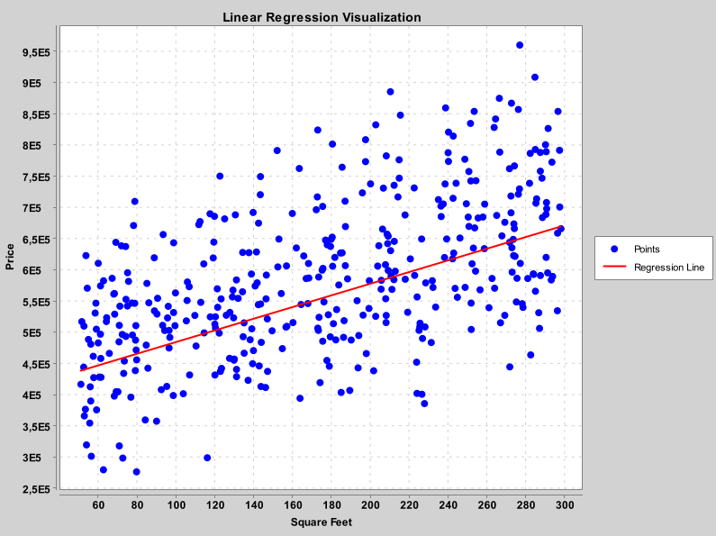
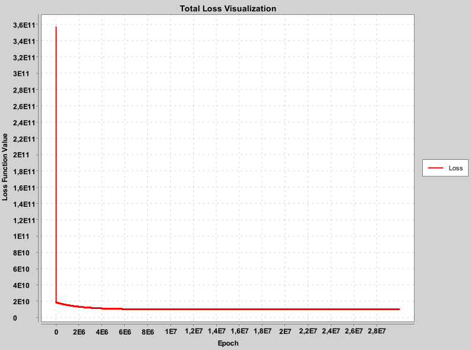

# JArtificialIntelligence Library

Welcome to the JArtificialIntelligence library! This library provides tools for data management, model training, and visualization, making it easier to build and evaluate machine learning models in Java.

<!-- Put some banner:  -->

## Table of Contents
- [Motivation](#motivation)
- [Example Data Sets and Code](#example-data-sets-and-code)
- [JDataFrame Class](#jdataframe-class)
- [Model Types](#model-types)
    - [Regression](#regression)
        - [Linear Regression](#linear-regression)
        - [Non-Linear Regression](#non-linear-regression)
    - [Classification](#classification)
- [Plotter Types](#plotter-types)
    - [Regression Plotter](#regression-plotter)
        - [Linear Regression Plotter](#linear-regression-plotter)
- [Acknowledgements](#acknowledgements)
- [Learning and Development](#learning-and-development)

## Motivation
I designed this library for easy third-party integration and paid attention to making it simple to write code.
My goal is to find a balance between precision and code length, ensuring that the library is both powerful and user-friendly.

## Example Data Sets and Code
You can find example data sets in the [datasets](datasets) directory and example code for each core module in the [examples](/src/main/java/examples) directory. This includes sample implementations and usage of various classes and methods provided by the library.

## JDataFrame Class
The [JDataFrame](./src/main/java/com/maksymiliangach/ai/DataManager/JDataFrame.java) class is designed to handle data in tabular form, similar to data frames in other data science libraries. It provides methods for loading data from CSV files, manipulating columns and rows, and preparing data for model training. It also allows for easy feature engineering by creating new columns that are combinations of existing ones.

## Model Types

### Regression
The library supports various regression models. Below is an example of how to use the [LinearRegression](./src/main/java/com/maksymiliangach/ai/Regression/LinearRegression/LinearRegression.java) model.

#### Linear Regression
The [LinearRegression](./src/main/java/com/maksymiliangach/ai/Regression/LinearRegression/LinearRegression.java) class provides a simple linear regression model. Here's how to use it:

```java
// Create LinearRegression model with learning_rate = 0.00000210 and epochs = 10_000_000 
LinearRegression model = new LinearRegression(0.00000210, 10_000_000);

// Train the model on training data
model.train(trainingInputData, trainingOutputData);

// Predict value for real life scenarios
// I want to estimate the price of a house with:
// Square_Feet = 93.59
// Garage_Size = 26.0
// Location_Score = 4.63
double[] houseFeatures = {93.59, 26.0, 4.63};

// Get price prediction
double prediction = model.predict(houseFeatures);
```

#### Non-Linear Regression
*[TO BE IMPLEMENTED...]*

### Classification
*[TO BE IMPLEMENTED...]*

## Plotter Types
### Regression Plotter
#### Linear Regression Plotter
The [LinearRegressionPlotter](./src/main/java/com/maksymiliangach/ai/Plotter/LinearRegressionPlotter.java) class provides tools for visualizing the training process and the training data.
Here's how to assign a plotter to the model correctly:

```java
// Create plotter
LinearRegressionPlotter plotter = new LinearRegressionPlotter();

// Customize the plotter 
plotter.setDisplayDataPlot(true)
               .setDisplayLossPlot(true)
               .setDataLabels("Linear Regression Visualization", "Square Feet", "Price")
               .setLossLabels("Total Loss Visualization", "Epoch", "Loss Function Value");

// Assign plotter to predefined LinearRegression model 
model.setPlotter(plotter);

// Train model after plotter was assigned
model.train(trainingInputData, trainingOutputData);

// Now the plotter is assigned and starts visualizing the training process
```
<center>
    <p float="left">
        
        
    </p>
</center>
<center>Example Training Visualization</center>


## Acknowledgements
This project uses XChart plotting library for visualizations. You can find more information about the library [here](https://github.com/knowm/XChart).  
Datasets for examples and testings were taken from [Kaggle](https://www.kaggle.com/) website:
- [real_estate_dataset.csv](https://www.kaggle.com/datasets/denkuznetz/housing-prices-regression)

## Learning and Development
This is my first approach to building a library, and I am still learning. I appreciate any feedback and suggestions for improvement.
Feel free to reach out to me at:

<!-- [](https://about:blank) -->
[](mailto:gach.maksymilian@gmail.com)

